# 🛒 Carrinho de Compras com ASP.NET Core MVC

## Tutorial Prático — .NET 8 + SQL Server + Entity Framework Core + Database First + Scaffold

Este tutorial apresenta uma prática de desenvolvimento web utilizando **ASP.NET Core MVC (.NET 8)**, **SQL Server**, **Entity Framework Core** e a abordagem **Database First (Engenharia Reversa)**.

A proposta é desenvolver uma loja virtual simples, trabalhando com produtos cadastrados no banco de dados e um carrinho armazenado em **Session**.

> 📌 **Base do tutorial:** material didático fornecido para a prática de Carrinho de Compras com ASP.NET Core MVC.  
> As etapas abaixo preservam a sequência e os conceitos do material original, com contribuições adicionais para completar o funcionamento do carrinho.

---

## 🎯 Objetivo da Prática

Ao final da prática, o aluno deverá ser capaz de:

- Listar produtos cadastrados no banco de dados.
- Utilizar **Scaffold / Engenharia Reversa** para gerar Model e DbContext.
- Criar o CRUD de produtos utilizando Scaffold.
- Adicionar produtos ao carrinho em memória utilizando **Session**.
- Alterar a quantidade quando o produto já estiver no carrinho.
- Calcular o subtotal individual de cada item.
- Calcular o valor total do carrinho.
- Remover itens do carrinho.
- Trabalhar com uma estrutura de carrinho independente das tabelas do banco.
- Evoluir posteriormente a apresentação dos produtos para formato de **Cards**.

---

# 🔄 Fluxo do Aprendizado

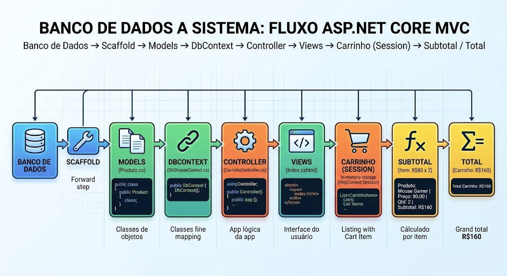

```text
SQL Server
    ↓
Banco de dados dbShopee
    ↓
Tabela Produto
    ↓
Scaffold / Engenharia Reversa
    ↓
Produto.cs + DbShopeeContext.cs
    ↓
String de conexão
    ↓
Injeção de dependência
    ↓
Scaffold do ProdutoController
    ↓
CRUD de Produtos
    ↓
CarrinhoController
    ↓
CarrinhoItem
    ↓
Session
    ↓
Adicionar produto
    ↓
Quantidade
    ↓
Subtotal
    ↓
Total
    ↓
Remover produto
```

---

# 🛍️ Cenário

Imagine uma pequena loja virtual.

O cliente poderá visualizar os produtos disponíveis e adicioná-los ao carrinho.

### Exemplo

| Produto | Preço | Quantidade | Subtotal |
|---|---:|---:|---:|
| Mouse Gamer | R$ 80,00 | 2 | R$ 160,00 |
| Teclado Mecânico | R$ 150,00 | 1 | R$ 150,00 |
| **TOTAL** | | | **R$ 310,00** |

### Regra do subtotal

```text
Subtotal = Preço × Quantidade
```

### Regra do total

```text
Total = Soma dos subtotais
```

---

# 1️⃣ Banco de Dados — SQL Server

No **SQL Server Management Studio (SSMS)**, execute:

```sql
CREATE DATABASE dbShopee;
GO

USE dbShopee;
GO

CREATE TABLE Produto
(
    Codigo INT IDENTITY(1,1) PRIMARY KEY,
    Nome VARCHAR(100) NOT NULL,
    Preco DECIMAL(10,2) NOT NULL,
    Estoque INT NOT NULL
);
GO

INSERT INTO Produto (Nome, Preco, Estoque)
VALUES
('Mouse Gamer', 80.00, 20),
('Teclado Mecânico', 150.00, 15),
('Headset Gamer', 120.00, 10),
('Mouse Pad', 35.00, 30),
('Webcam Full HD', 200.00, 8);
GO

SELECT * FROM Produto;
```

### Estrutura criada

| Campo | Tipo | Regra |
|---|---|---|
| Codigo | INT | Identity + Primary Key |
| Nome | VARCHAR(100) | NOT NULL |
| Preco | DECIMAL(10,2) | NOT NULL |
| Estoque | INT | NOT NULL |

---

# 2️⃣ Criar o Projeto no Visual Studio

1. Abra o **Visual Studio**.
2. Selecione **Create a new project**.
3. Escolha:

```text
ASP.NET Core Web App (Model-View-Controller)
```

4. Nome do projeto:

```text
ShopeeMVC
```

5. Framework:

```text
.NET 8.0
```

---

# 3️⃣ Instalar os Pacotes do Entity Framework Core

No Visual Studio, abra:

**Ferramentas → Gerenciador de Pacotes NuGet → Console do Gerenciador de Pacotes**

Execute:

```powershell
Install-Package Microsoft.EntityFrameworkCore.SqlServer
Install-Package Microsoft.EntityFrameworkCore.Tools
Install-Package Microsoft.EntityFrameworkCore.Design
```

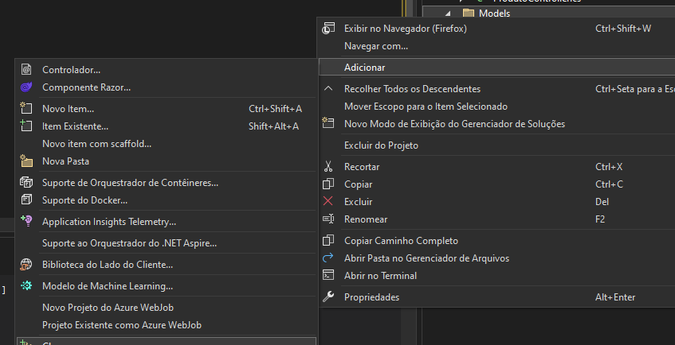

---

# 4️⃣ Engenharia Reversa — Scaffold do Banco

Agora vamos gerar as classes do projeto a partir do banco existente.

No **Package Manager Console**, utilize o comando:

```powershell
Scaffold-DbContext "Server=SEU_SERVIDOR;Database=dbShopee;User id=SEU_USUARIO;Password=SUA_SENHA;TrustServerCertificate=True;" Microsoft.EntityFrameworkCore.SqlServer -OutputDir Models
```

> ⚠️ **Importante:** substitua `SEU_SERVIDOR`, `SEU_USUARIO` e `SUA_SENHA` pelos dados do seu ambiente.

> 🔐 Não publique usuário e senha reais no GitHub.

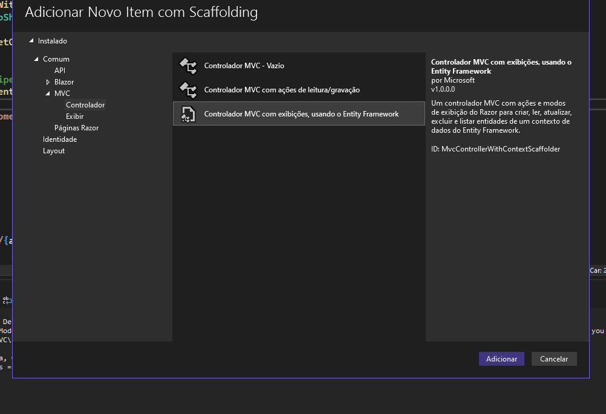

Após o Scaffold, teremos principalmente:

```text
Models
├── Produto.cs
└── DbShopeeContext.cs
```

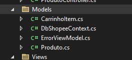

---

# 5️⃣ String de Conexão no `appsettings.json`

Abra:

```text
appsettings.json
```

Adicione:

```json
{
  "ConnectionStrings": {
    "ConexaoBanco": "Server=SEU_SERVIDOR;Database=dbShopee;User id=SEU_USUARIO;Password=SUA_SENHA;TrustServerCertificate=True;"
  },
  "Logging": {
    "LogLevel": {
      "Default": "Information",
      "Microsoft.AspNetCore": "Warning"
    }
  },
  "AllowedHosts": "*"
}
```

> ⚠️ Não coloque credenciais reais em um README público.

---

# 6️⃣ Registrar o DbContext e a Session no `Program.cs`

Adicione:

```csharp
using Microsoft.EntityFrameworkCore;
using ShopeeMVC.Models;
```

Configure o DbContext:

```csharp
builder.Services.AddDbContext<DbShopeeContext>(options =>
    options.UseSqlServer(
        builder.Configuration.GetConnectionString("ConexaoBanco")));
```

Para utilizar Session:

```csharp
builder.Services.AddDistributedMemoryCache();
builder.Services.AddSession();
```

E no pipeline:

```csharp
app.UseRouting();

app.UseSession();

app.UseAuthorization();
```

### Exemplo completo

```csharp
var builder = WebApplication.CreateBuilder(args);

builder.Services.AddControllersWithViews();

builder.Services.AddDbContext<DbShopeeContext>(options =>
    options.UseSqlServer(
        builder.Configuration.GetConnectionString("ConexaoBanco")));

builder.Services.AddDistributedMemoryCache();
builder.Services.AddSession();

var app = builder.Build();

if (!app.Environment.IsDevelopment())
{
    app.UseExceptionHandler("/Home/Error");
    app.UseHsts();
}

app.UseHttpsRedirection();
app.UseStaticFiles();

app.UseRouting();

app.UseSession();

app.UseAuthorization();

app.MapControllerRoute(
    name: "default",
    pattern: "{controller=Produto}/{action=Index}/{id?}");

app.Run();
```

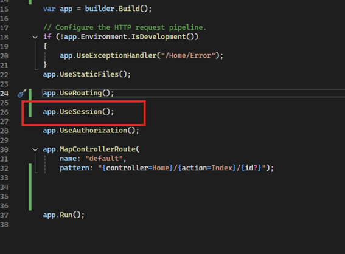

---

# 7️⃣ Criar o `ProdutoController` via Scaffold

Clique com o botão direito em:

```text
Controllers
```

Depois:

```text
Adicionar
→ Item do Scaffold
→ Controlador do MVC com exibições, usando o Entity Framework
```

Preencha:

```text
Classe de modelo:
Produto (ShopeeMVC.Models)

Classe do contexto de dados:
DbShopeeContext (ShopeeMVC.Models)

Nome do controlador:
ProdutoController
```

Clique em **Adicionar**.

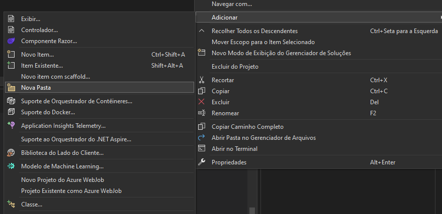

O Visual Studio irá gerar as telas do CRUD.

```text
Views
└── Produto
    ├── Create.cshtml
    ├── Delete.cshtml
    ├── Details.cshtml
    ├── Edit.cshtml
    └── Index.cshtml
```

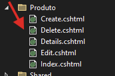

---

# 8️⃣ Testar o CRUD de Produtos

Execute:

```text
Ctrl + F5
```

Acesse:

```text
/Produto
```

Exemplo:

```text
https://localhost:xxxx/Produto
```

Você deverá visualizar os produtos cadastrados.

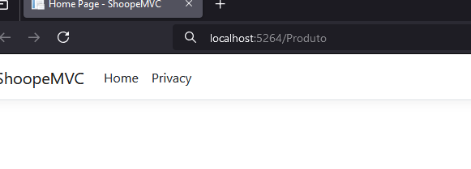

---

# 🛒 9️⃣ Agora começa o desafio do Carrinho

Aqui temos uma diferença importante.

O banco possui:

```text
Produto
```

Mas ainda não temos uma tabela:

```text
Carrinho
```

Para esta prática inicial, **não precisamos criar uma tabela Carrinho**.

Vamos trabalhar com o carrinho em memória utilizando:

```text
Session
```

O objetivo é compreender:

```text
Produto
   ↓
Carrinho
   ↓
Quantidade
   ↓
Subtotal
   ↓
Total
```

---

# 1️⃣0️⃣ Criar o `CarrinhoController`

Na pasta:

```text
Controllers
```

Clique com o botão direito:

```text
Adicionar → Controlador
```

Crie:

```text
CarrinhoController
```

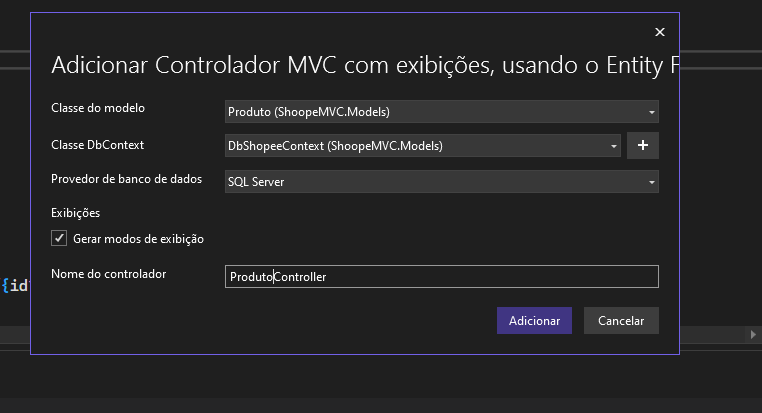

Inicialmente:

```csharp
using Microsoft.AspNetCore.Mvc;
using Microsoft.EntityFrameworkCore;
using ShopeeMVC.Models;

namespace ShopeeMVC.Controllers
{
    public class CarrinhoController : Controller
    {
        private readonly DbShopeeContext _context;

        public CarrinhoController(DbShopeeContext context)
        {
            _context = context;
        }

        public IActionResult Index()
        {
            return View();
        }
    }
}
```

---

# 1️⃣1️⃣ Criar a View do Carrinho

Crie:

```text
Views
└── Carrinho
    └── Index.cshtml
```

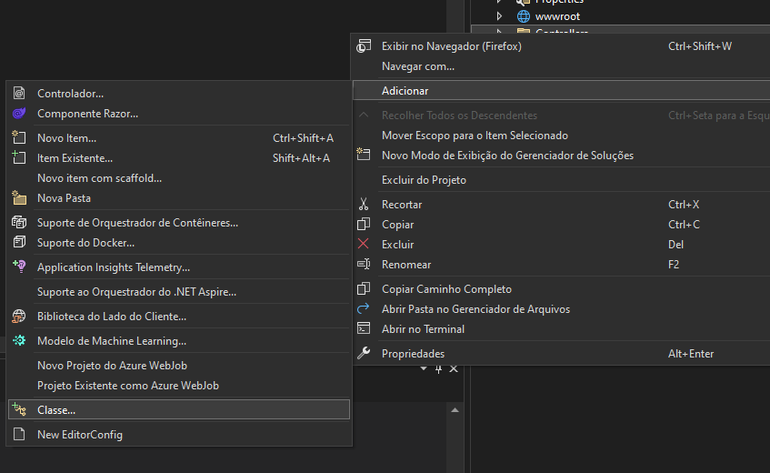

Escolha:

```text
Razor Vazia
```

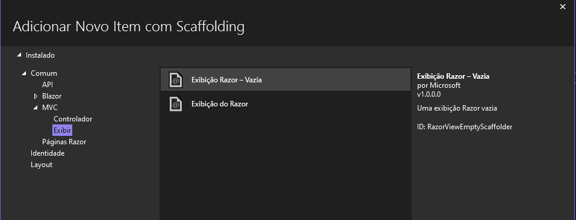

Nome:

```text
Index
```

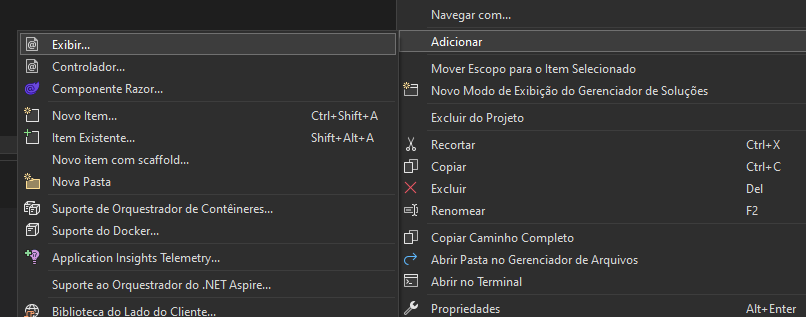

Inicialmente:

```cshtml
@{
    ViewData["Title"] = "Meu Carrinho";
}

<h1>Meu Carrinho</h1>

<p>Nenhum produto adicionado.</p>
```

Resultado inicial:

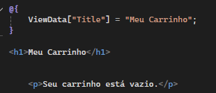

Agora temos:

```text
/Produto
```

e:

```text
/Carrinho
```

---

# 1️⃣2️⃣ Adicionar o botão "Adicionar ao Carrinho"

Na:

```text
Views/Produto/Index.cshtml
```

adicione:

```html
<a asp-controller="Carrinho"
   asp-action="Adicionar"
   asp-route-id="@item.Codigo"
   class="btn btn-primary">
    Adicionar ao carrinho
</a>
```

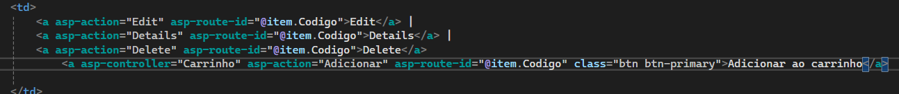

---

# 1️⃣3️⃣ Criar o método `Adicionar`

No `CarrinhoController`:

```csharp
public async Task<IActionResult> Adicionar(int id)
{
    var produto = await _context.Produtos
        .FirstOrDefaultAsync(p => p.Codigo == id);

    if (produto == null)
    {
        return NotFound();
    }

    return RedirectToAction(nameof(Index));
}
```

Neste momento:

> Encontramos o produto no banco. Mas onde vamos guardar o produto que o usuário adicionou?

---

# 1️⃣4️⃣ Criar a classe `CarrinhoItem`

A classe:

```text
Models/CarrinhoItem.cs
```

**não veio do banco de dados**.

Ela representa uma informação temporária utilizada pela aplicação para montar o carrinho.

Crie:

```text
Models
→ Adicionar
→ Classe
→ CarrinhoItem.cs
```

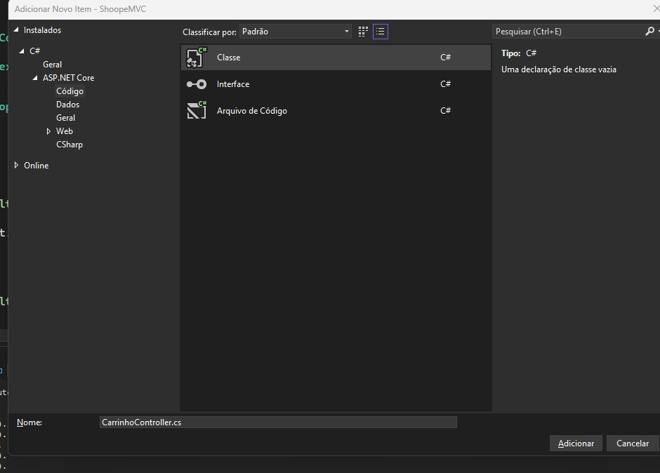

Use:

```csharp
namespace ShopeeMVC.Models
{
    public class CarrinhoItem
    {
        public int ProdutoId { get; set; }

        public string Nome { get; set; } = string.Empty;

        public decimal Preco { get; set; }

        public int Quantidade { get; set; }

        public decimal Subtotal
        {
            get
            {
                return Preco * Quantidade;
            }
        }
    }
}
```

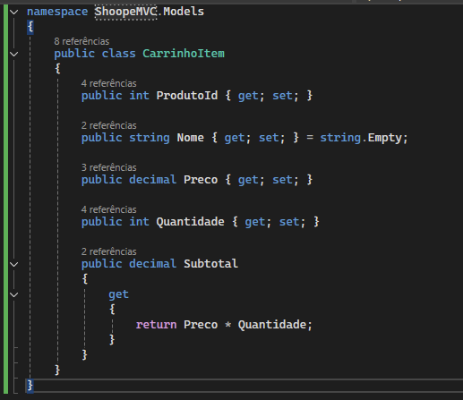

### 💡 Por que `Subtotal` não é armazenado?

Porque ele pode ser calculado:

```text
Subtotal = Preço × Quantidade
```

Portanto, não precisamos gravar o subtotal no banco.

---

# 1️⃣5️⃣ Habilitar Session

No `Program.cs`:

```csharp
builder.Services.AddDistributedMemoryCache();
builder.Services.AddSession();
```

E antes de:

```csharp
app.Run();
```

utilize:

```csharp
app.UseSession();
```

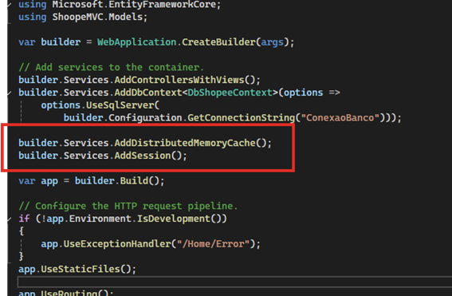

---

# 1️⃣6️⃣ Alterar o `CarrinhoController`

Adicione:

```csharp
using System.Text.Json;
```

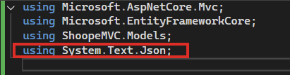

Agora vamos criar o método responsável por recuperar o carrinho da Session.

---

# 1️⃣7️⃣ Obter o Carrinho da Session

```csharp
private List<CarrinhoItem> ObterCarrinho()
{
    var carrinhoJson = HttpContext.Session.GetString("Carrinho");

    if (string.IsNullOrEmpty(carrinhoJson))
    {
        return new List<CarrinhoItem>();
    }

    return JsonSerializer.Deserialize<List<CarrinhoItem>>(carrinhoJson)
           ?? new List<CarrinhoItem>();
}
```

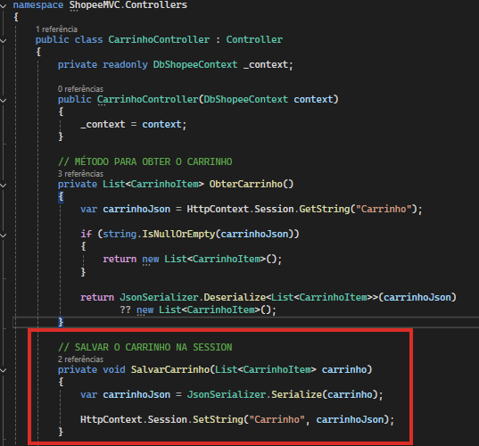

---

# 1️⃣8️⃣ Salvar o Carrinho na Session

Agora precisamos do processo inverso:

```csharp
private void SalvarCarrinho(List<CarrinhoItem> carrinho)
{
    var carrinhoJson = JsonSerializer.Serialize(carrinho);

    HttpContext.Session.SetString("Carrinho", carrinhoJson);
}
```

A lógica é:

```text
Lista de objetos
      ↓
JSON
      ↓
Session
```

E para recuperar:

```text
Session
      ↓
JSON
      ↓
Lista de objetos
```

---

# 1️⃣9️⃣ Completar o método `Adicionar`

Agora altere o método `Adicionar`:

```csharp
public async Task<IActionResult> Adicionar(int id)
{
    var produto = await _context.Produtos
        .FirstOrDefaultAsync(p => p.Codigo == id);

    if (produto == null)
    {
        return NotFound();
    }

    var carrinho = ObterCarrinho();

    var item = carrinho.FirstOrDefault(
        x => x.ProdutoId == produto.Codigo
    );

    if (item == null)
    {
        carrinho.Add(new CarrinhoItem
        {
            ProdutoId = produto.Codigo,
            Nome = produto.Nome,
            Preco = produto.Preco,
            Quantidade = 1
        });
    }
    else
    {
        item.Quantidade++;
    }

    // IMPORTANTE:
    // Salvar o carrinho na Session
    SalvarCarrinho(carrinho);

    return RedirectToAction(nameof(Index));
}
```

### 🔎 O que acontece aqui?

Se o produto ainda não estiver no carrinho:

```csharp
Quantidade = 1
```

Se já estiver:

```csharp
item.Quantidade++;
```

Assim, ao adicionar o mesmo produto novamente, sua quantidade aumenta.

---

# 2️⃣0️⃣ Exibir o Carrinho

Altere o método `Index()`.

### Antes

```csharp
public IActionResult Index()
{
    return View();
}
```

### Depois

```csharp
public IActionResult Index()
{
    var carrinho = ObterCarrinho();

    return View(carrinho);
}
```

A View passa a receber a lista:

```cshtml
@model List<ShopeeMVC.Models.CarrinhoItem>
```

---

# 2️⃣1️⃣ Criar a tabela do Carrinho

Em:

```text
Views/Carrinho/Index.cshtml
```

utilize:

```cshtml
@model List<ShopeeMVC.Models.CarrinhoItem>

@{
    ViewData["Title"] = "Meu Carrinho";
}

<h1>Meu Carrinho</h1>

@if (!Model.Any())
{
    <p>Seu carrinho está vazio.</p>
}
else
{
    <table class="table">
        <thead>
            <tr>
                <th>Produto</th>
                <th>Preço</th>
                <th>Quantidade</th>
                <th>Subtotal</th>
            </tr>
        </thead>

        <tbody>

        @foreach (var item in Model)
        {
            <tr>
                <td>@item.Nome</td>

                <td>
                    @item.Preco.ToString("C")
                </td>

                <td>
                    @item.Quantidade
                </td>

                <td>
                    @item.Subtotal.ToString("C")
                </td>
            </tr>
        }

        </tbody>
    </table>

    <h3>
        Total:
        @Model.Sum(x => x.Subtotal).ToString("C")
    </h3>
}
```

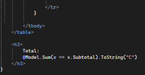

---

# 2️⃣2️⃣ Testar o Carrinho

Agora:

1. Acesse `/Produto`.
2. Escolha um produto.
3. Clique em **Adicionar ao carrinho**.
4. Acesse `/Carrinho`.

Você deverá visualizar os produtos adicionados e seus respectivos subtotais.

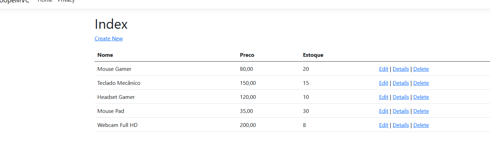

---

# 2️⃣3️⃣ Uma correção importante

Durante a construção do carrinho existe um detalhe fundamental.

O código pode adicionar o item à lista:

```csharp
if (item == null)
{
    carrinho.Add(new CarrinhoItem
    {
        ProdutoId = produto.Codigo,
        Nome = produto.Nome,
        Preco = produto.Preco,
        Quantidade = 1
    });
}
else
{
    item.Quantidade++;
}
```

Mas isso **não é suficiente**.

A lista foi alterada apenas em memória.

É necessário salvar novamente na Session:

```csharp
SalvarCarrinho(carrinho);
```

Portanto:

```csharp
if (item == null)
{
    carrinho.Add(new CarrinhoItem
    {
        ProdutoId = produto.Codigo,
        Nome = produto.Nome,
        Preco = produto.Preco,
        Quantidade = 1
    });
}
else
{
    item.Quantidade++;
}

SalvarCarrinho(carrinho);

return RedirectToAction(nameof(Index));
```

### 🧠 Conceito importante

```text
ObterCarrinho()
      ↓
Alterar lista
      ↓
SalvarCarrinho()
      ↓
Session
```

Essa é uma das principais ideias da prática.

---

# 2️⃣4️⃣ Remover produto do Carrinho

## ➕ Contribuição adicional

Para completar o fluxo do carrinho, podemos adicionar a funcionalidade de **remover um produto**.

No `CarrinhoController`:

```csharp
public IActionResult Remover(int id)
{
    var carrinho = ObterCarrinho();

    var item = carrinho.FirstOrDefault(
        x => x.ProdutoId == id
    );

    if (item != null)
    {
        carrinho.Remove(item);
    }

    SalvarCarrinho(carrinho);

    return RedirectToAction(nameof(Index));
}
```

A lógica é:

```text
Recebe o ID
    ↓
Obtém o carrinho
    ↓
Localiza o item
    ↓
Remove da lista
    ↓
Salva novamente na Session
    ↓
Volta para o Carrinho
```

---

# 2️⃣5️⃣ Criar o botão "Remover"

Na tabela da View:

```cshtml
<thead>
    <tr>
        <th>Produto</th>
        <th>Preço</th>
        <th>Quantidade</th>
        <th>Subtotal</th>
        <th>Ações</th>
    </tr>
</thead>
```

E dentro do `foreach`:

```cshtml
<td>
    <a asp-controller="Carrinho"
       asp-action="Remover"
       asp-route-id="@item.ProdutoId"
       class="btn btn-danger btn-sm">
        Remover
    </a>
</td>
```

O resultado será:

```text
Produto        Preço       Qtd.      Subtotal       Ações
-------------------------------------------------------------
Mouse Gamer    R$ 80,00     2        R$ 160,00      Remover
Teclado        R$ 150,00    1        R$ 150,00      Remover
```

---

# 2️⃣6️⃣ Código Final do `CarrinhoController`

Ao final, o Controller ficará semelhante a:

```csharp
using Microsoft.AspNetCore.Mvc;
using Microsoft.EntityFrameworkCore;
using ShopeeMVC.Models;
using System.Text.Json;

namespace ShopeeMVC.Controllers
{
    public class CarrinhoController : Controller
    {
        private readonly DbShopeeContext _context;

        public CarrinhoController(DbShopeeContext context)
        {
            _context = context;
        }

        // OBTER O CARRINHO DA SESSION
        private List<CarrinhoItem> ObterCarrinho()
        {
            var carrinhoJson =
                HttpContext.Session.GetString("Carrinho");

            if (string.IsNullOrEmpty(carrinhoJson))
            {
                return new List<CarrinhoItem>();
            }

            return JsonSerializer.Deserialize<List<CarrinhoItem>>(carrinhoJson)
                   ?? new List<CarrinhoItem>();
        }

        // SALVAR O CARRINHO NA SESSION
        private void SalvarCarrinho(List<CarrinhoItem> carrinho)
        {
            var carrinhoJson =
                JsonSerializer.Serialize(carrinho);

            HttpContext.Session.SetString(
                "Carrinho",
                carrinhoJson
            );
        }

        // EXIBIR O CARRINHO
        public IActionResult Index()
        {
            var carrinho = ObterCarrinho();

            return View(carrinho);
        }

        // ADICIONAR PRODUTO
        public async Task<IActionResult> Adicionar(int id)
        {
            var produto = await _context.Produtos
                .FirstOrDefaultAsync(p => p.Codigo == id);

            if (produto == null)
            {
                return NotFound();
            }

            var carrinho = ObterCarrinho();

            var item = carrinho.FirstOrDefault(
                x => x.ProdutoId == produto.Codigo
            );

            if (item == null)
            {
                carrinho.Add(new CarrinhoItem
                {
                    ProdutoId = produto.Codigo,
                    Nome = produto.Nome,
                    Preco = produto.Preco,
                    Quantidade = 1
                });
            }
            else
            {
                item.Quantidade++;
            }

            SalvarCarrinho(carrinho);

            return RedirectToAction(nameof(Index));
        }

        // REMOVER PRODUTO
        public IActionResult Remover(int id)
        {
            var carrinho = ObterCarrinho();

            var item = carrinho.FirstOrDefault(
                x => x.ProdutoId == id
            );

            if (item != null)
            {
                carrinho.Remove(item);
            }

            SalvarCarrinho(carrinho);

            return RedirectToAction(nameof(Index));
        }
    }
}
```

---

# 🧠 O que foi aprendido?

Durante esta prática foram trabalhados:

- ASP.NET Core MVC
- .NET 8
- C#
- SQL Server
- Entity Framework Core
- Database First
- Engenharia Reversa
- Scaffold
- Model
- DbContext
- Controller
- Views
- Razor
- Injeção de Dependência
- Session
- JSON
- Lista em memória
- Quantidade
- Subtotal
- Total
- Remoção de itens

---

# 🔄 Fluxo Final da Aplicação

```text
┌───────────────────┐
│    SQL Server     │
│     dbShopee      │
└─────────┬─────────┘
          │
          ▼
┌───────────────────┐
│  Tabela Produto   │
└─────────┬─────────┘
          │
          ▼
┌───────────────────┐
│ Scaffold / EF Core│
└─────────┬─────────┘
          │
          ▼
┌───────────────────┐
│ ProdutoController │
└─────────┬─────────┘
          │
          ▼
┌───────────────────┐
│     Produtos      │
└─────────┬─────────┘
          │
          │ Adicionar
          ▼
┌───────────────────┐
│ CarrinhoController│
└─────────┬─────────┘
          │
          ▼
┌───────────────────┐
│   CarrinhoItem    │
└─────────┬─────────┘
          │
          ▼
┌───────────────────┐
│      Session      │
└─────────┬─────────┘
          │
          ├── Quantidade
          ├── Subtotal
          ├── Total
          └── Remover
```

---

# 🚀 Próximas etapas

A aplicação pode evoluir para:

- ➕ Aumentar quantidade.
- ➖ Diminuir quantidade.
- 🖼️ Exibir produtos em Cards.
- 📷 Adicionar imagens aos produtos.
- 🛒 Melhorar a interface do carrinho.
- 💰 Criar resumo da compra.
- 📦 Controlar estoque.
- 💳 Criar etapa de checkout.
- 👤 Associar o carrinho ao usuário.

---

# 👨‍💻 Contribuições desta versão

Além do fluxo apresentado no material-base, esta versão do tutorial inclui:

### ✅ Correção do armazenamento na Session

Foi destacado o `SalvarCarrinho(carrinho)` após a alteração da lista, evitando que o item seja alterado apenas em memória e não permaneça no carrinho.

### ✅ Funcionalidade de remoção

Foi acrescentado:

```csharp
Remover(int id)
```

e o respectivo botão na View.

### ✅ Organização para publicação no GitHub

As credenciais de conexão foram substituídas por placeholders:

```text
SEU_SERVIDOR
SEU_USUARIO
SUA_SENHA
```

Assim o tutorial pode ser publicado sem expor credenciais reais.

### ✅ Fluxo didático

O passo a passo foi organizado para evidenciar a sequência:

```text
Banco
→ Scaffold
→ DbContext
→ Controller
→ View
→ Session
→ Carrinho
→ Quantidade
→ Subtotal
→ Total
→ Remover
```

---

# 📚 Tecnologias


---

## 📌 Observação

As imagens utilizadas neste README foram extraídas do material original fornecido para a prática e organizadas na pasta:

```text
images/
```

Por isso, para que as imagens apareçam no GitHub, mantenha a pasta `images` no mesmo nível deste `README.md`.

```text
LabSoftUseCase
│
├── README.md
│
└── images
    ├── 01-fluxo-aplicacao.png
    ├── 02-scaffold-controlador.png
    ├── ...
    └── 29-codigo-adicionar.png
```
