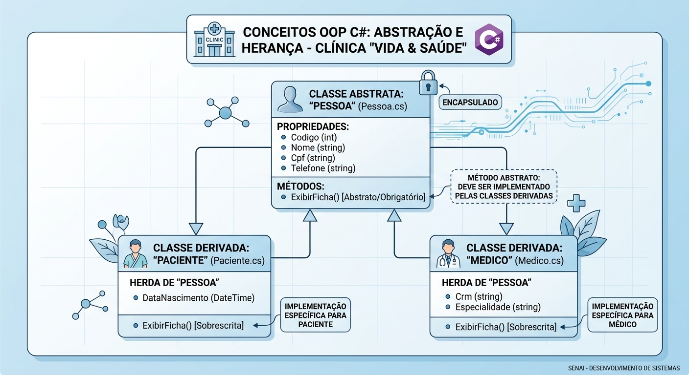

# 🚀 Guia Prático: POO C# - ESTRUTURA E REGRAS DE NEGÓCIO DA CLÍNICA MÉDICA

## 📌 Contexto do Projeto: Sistema Interno da Clínica "Vida & Saúde"

Antes de persistir dados em banco de dados ou construir APIs, é fundamental estruturar o domínio da aplicação utilizando os conceitos centrais da Programação Orientada a Objetos (POO).

Nesta atividade, você desenvolverá uma aplicação Console em **C# (.NET 9)** focada no gerenciamento interno da clínica médica "Vida & Saúde". O objetivo principal é aplicar os pilares de **Abstração, Herança, Encapsulamento, Polimorfismo**, além do uso de **Interfaces** e manipulação de dados em memória usando **Listas (`List<T>`)**.

---

## 🛠️ Pré-requisitos
- Visual Studio 2022 ou VS Code (com .NET 9 SDK instalado)
- Conhecimentos básicos da sintaxe do C#

---

## 🎯 Objetivos de Aprendizagem
1. **Criar Classes e Atributos**: Modelar entidades reais com propriedades e métodos bem definidos.
2. **Implementar Herança**: Criar classes derivadas aproveitando atributos e comportamentos de uma classe base abstrata.
3. **Implementar Interfaces**: Definir contratos para padronizar relatórios e notificações no sistema.
4. **Manipular Listas (`List<T>`)**: Utilizar coleções genéricas e consultas LINQ para gerenciar dados em memória.

---

## 📋 Atividade Prática: Passo a Passo

---

### 📂 Etapa 1: Estrutura Base e Herança (Pessoa, Paciente e Medico)

Como pacientes e médicos compartilham características comuns (Nome, CPF e Telefone), vamos criar uma classe base abstrata para evitar repetição de código.

  

#### Subtarefa 1.1: Criar a classe abstrata `Pessoa`
1. Crie a classe abstrata `Pessoa.cs`.
2. Encapsule as propriedades: `Codigo` (int), `Nome` (string), `Cpf` (string) e `Telefone` (string).
3. Adicione o método abstrato `ExibirFicha()`, que deverá ser implementado obrigatoriamente pelas classes derivadas.

```csharp
namespace ClinicaPOO.Models
{
    public abstract class Pessoa
    {
        public int Codigo { get; set; }
        public string Nome { get; set; } = string.Empty;
        public string Cpf { get; set; } = string.Empty;
        public string Telefone { get; set; } = string.Empty;

        protected Pessoa(int codigo, string nome, string cpf, string telefone)
        {
            Codigo = codigo;
            Nome = nome;
            Cpf = cpf;
            Telefone = telefone;
        }

        // Método abstrato obrigatório para implementação das filhas
        public abstract void ExibirFicha();
    }
}
```

#### Subtarefa 1.2: Criar a classe `Paciente` (Herdando de Pessoa)
1. Crie a classe `Paciente.cs` herdando de `Pessoa`.
2. Adicione a propriedade `DataNascimento` (DateTime).
3. Sobrescreva o método `ExibirFicha()` para mostrar os dados específicos do paciente.

```csharp
namespace ClinicaPOO.Models
{
    public class Paciente : Pessoa
    {
        public DateTime DataNascimento { get; set; }

        public Paciente(int codigo, string nome, string cpf, string telefone, DateTime dataNascimento)
            : base(codigo, nome, cpf, telefone)
        {
            DataNascimento = dataNascimento;
        }

        public override void ExibirFicha()
        {
            Console.WriteLine($"[PACIENTE] Cód: {Codigo} | Nome: {Nome} | CPF: {Cpf} | Data Nasc: {DataNascimento:dd/MM/yyyy}");
        }
    }
}
```

#### Subtarefa 1.3: Criar a classe `Medico` (Herdando de Pessoa)
1. Crie a classe `Medico.cs` herdando de `Pessoa`.
2. Adicione as propriedades `Crm` (string) e `Especialidade` (string).
3. Sobrescreva o método `ExibirFicha()`.

```csharp
namespace ClinicaPOO.Models
{
    public class Medico : Pessoa
    {
        public string Crm { get; set; }
        public string Especialidade { get; set; }

        public Medico(int codigo, string nome, string cpf, string telefone, string crm, string especialidade)
            : base(codigo, nome, cpf, telefone)
        {
            Crm = crm;
            Especialidade = especialidade;
        }

        public override void ExibirFicha()
        {
            Console.WriteLine($"[MÉDICO] Cód: {Codigo} | Dr(a). {Nome} | CRM: {Crm} | Esp: {Especialidade}");
        }
    }
}
```

---

### 📂 Etapa 2: Implementando Contratos com Interfaces

Interfaces garantem que diferentes classes sigam um mesmo padrão de comportamento sem necessariamente compor uma relação de herança.


  

#### Subtarefa 2.1: Criar a interface `INotificavel`
Crie o arquivo `INotificavel.cs` na pasta `Interfaces`. Esta interface define a obrigatoriedade do envio de avisos aos pacientes.

```csharp
namespace ClinicaPOO.Interfaces
{
    public interface INotificavel
    {
        void EnviarNotificacao(string mensagem);
    }
}
```

#### Subtarefa 2.2: Criar a interface `IRelatorio`
Crie o arquivo `IRelatorio.cs` na pasta `Interfaces` para padronizar a geração de resumos textuais.

```csharp
namespace ClinicaPOO.Interfaces
{
    public interface IRelatorio
    {
        string GerarResumo();
    }
}
```

---

### 📂 Etapa 3: Classe `Consulta` e Aplicação de Interfaces

A classe `Consulta` será responsável por associar um paciente a um médico em uma data e horário específicos.

#### Subtarefa 3.1: Criar e implementar a classe `Consulta`
1. Crie a classe `Consulta.cs`.
2. Implemente as interfaces `INotificavel` e `IRelatorio`.
3. Adicione atributos e controle o `Status` da consulta através de métodos de mudança de estado (Cancelada, Realizada, Agendada).

```csharp
using ClinicaPOO.Interfaces;

namespace ClinicaPOO.Models
{
    public class Consulta : INotificavel, IRelatorio
    {
        public int Codigo { get; set; }
        public DateTime DataHora { get; set; }
        public Paciente Paciente { get; set; }
        public Medico Medico { get; set; }
        public string Status { get; private set; } // Modificador private para manter o encapsulamento

        public Consulta(int codigo, DateTime dataHora, Paciente paciente, Medico medico)
        {
            Codigo = codigo;
            DataHora = dataHora;
            Paciente = paciente;
            Medico = medico;
            Status = "Agendada";
        }

        public void Cancelar()
        {
            Status = "Cancelada";
            EnviarNotificacao($"Sua consulta agendada para {DataHora:dd/MM/yyyy HH:mm} foi CANCELADA.");
        }

        public void Realizar()
        {
            Status = "Realizada";
        }

        // Implementação do contrato INotificavel
        public void EnviarNotificacao(string mensagem)
        {
            Console.WriteLine($"[NOTIFICAÇÃO -> Telefone: {Paciente.Telefone}]: Olá {Paciente.Nome}, {mensagem}");
        }

        // Implementação do contrato IRelatorio
        public string GerarResumo()
        {
            return $"Consulta #{Codigo} | Data: {DataHora:dd/MM/yyyy HH:mm} | Status: [{Status}]\n" +
                   $"   Paciente: {Paciente.Nome} (CPF: {Paciente.Cpf})\n" +
                   $"   Médico: Dr(a). {Medico.Nome} ({Medico.Especialidade} - {Medico.Crm})";
        }
    }
}
```

---

### 📂 Etapa 4: Gerenciamento de Listas em Memória (`List<T>`)

Crie a classe `ClinicaService.cs` para gerenciar as listas de objetos (`List<T>`) e executar buscas e inserções.

#### Subtarefa 4.1: Criar a classe `ClinicaService`

```csharp
using ClinicaPOO.Models;

namespace ClinicaPOO.Services
{
    public class ClinicaService
    {
        // Declaração das Listas Genéricas
        public List<Paciente> Pacientes { get; private set; } = new List<Paciente>();
        public List<Medico> Medicos { get; private set; } = new List<Medico>();
        public List<Consulta> Consultas { get; private set; } = new List<Consulta>();

        public void CadastrarPaciente(Paciente paciente) => Pacientes.Add(paciente);
        
        public void CadastrarMedico(Medico medico) => Medicos.Add(medico);

        public void AgendarConsulta(int codigo, DateTime dataHora, int codigoPaciente, int codigoMedico)
        {
            // Busca dos objetos na lista usando LINQ
            var paciente = Pacientes.FirstOrDefault(p => p.Codigo == codigoPaciente);
            var medico = Medicos.FirstOrDefault(m => m.Codigo == codigoMedico);

            if (paciente == null)
            {
                Console.WriteLine("❌ Erro: Paciente não encontrado!");
                return;
            }

            if (medico == null)
            {
                Console.WriteLine("❌ Erro: Médico não encontrado!");
                return;
            }

            var novaConsulta = new Consulta(codigo, dataHora, paciente, medico);
            Consultas.Add(novaConsulta);

            Console.WriteLine("✅ Consulta agendada com sucesso!");
            
            // Disparando notificação via Interface
            novaConsulta.EnviarNotificacao($"sua consulta com Dr(a). {medico.Nome} foi confirmada.");
        }

        public void ExibirRelatorioGeral()
        {
            Console.WriteLine("\n=================== RELATÓRIO DE CONSULTAS ===================");
            if (Consultas.Count == 0)
            {
                Console.WriteLine("Nenhuma consulta registrada.");
                return;
            }

            foreach (var consulta in Consultas)
            {
                Console.WriteLine(consulta.GerarResumo());
                Console.WriteLine("--------------------------------------------------------------");
            }
        }
    }
}
```

---

### 📂 Etapa 5: Testando a Aplicação (`Program.cs`)

No arquivo `Program.cs`, monte a execução do programa instanciando objetos e executando as ações simuladas.

#### Subtarefa 5.1: Código do `Program.cs`

```csharp
using ClinicaPOO.Models;
using ClinicaPOO.Services;

var clinica = new ClinicaService();

Console.WriteLine("=== SISTEMA DA CLÍNICA VIDA & SAÚDE ===\n");

// 1. Criando e adicionando Pacientes
var p1 = new Paciente(1, "Maria Oliveira", "111.222.333-44", "(11) 98888-7777", new DateTime(1990, 5, 15));
var p2 = new Paciente(2, "João Souza", "555.666.777-88", "(11) 97777-6666", new DateTime(1985, 10, 20));

clinica.CadastrarPaciente(p1);
clinica.CadastrarPaciente(p2);

// 2. Criando e adicionando Médicos
var m1 = new Medico(1, "Helena Rios", "123.456.789-00", "(11) 91111-2222", "CRM/SP 123456", "Cardiologia");
var m2 = new Medico(2, "Roberto Alves", "987.654.321-11", "(11) 93333-4444", "CRM/SP 654321", "Ortopedia");

clinica.CadastrarMedico(m1);
clinica.CadastrarMedico(m2);

// 3. Testando o método polimórfico ExibirFicha()
Console.WriteLine("--- Cadastros Realizados ---");
p1.ExibirFicha();
m1.ExibirFicha();
Console.WriteLine();

// 4. Agendando Consultas
Console.WriteLine("--- Agendamentos ---");
clinica.AgendarConsulta(101, DateTime.Now.AddDays(2), 1, 1);
clinica.AgendarConsulta(102, DateTime.Now.AddDays(3), 2, 2);

// 5. Exibindo Relatório das Consultas
clinica.ExibirRelatorioGeral();

// 6. Testando alteração de estado (Cancelamento)
Console.WriteLine("\n--- Cancelamento de Consulta ---");
var consultaParaCancelar = clinica.Consultas.FirstOrDefault(c => c.Codigo == 101);
consultaParaCancelar?.Cancelar();

// Relatório Atualizado
clinica.ExibirRelatorioGeral();
```

---

## 🚀 Desafios Extras para Aprendizado

1. **Filtro de Médicos por Especialidade**: Crie um método no `ClinicaService` que receba uma especialidade como parâmetro e exiba apenas os médicos dessa área.
2. **Histórico do Paciente**: Adicione um método que liste todas as consultas vinculadas a um determinado CPF de paciente.
3. **Validação de Data**: Altere o método `AgendarConsulta` para impedir o agendamento de consultas em datas retroativas.